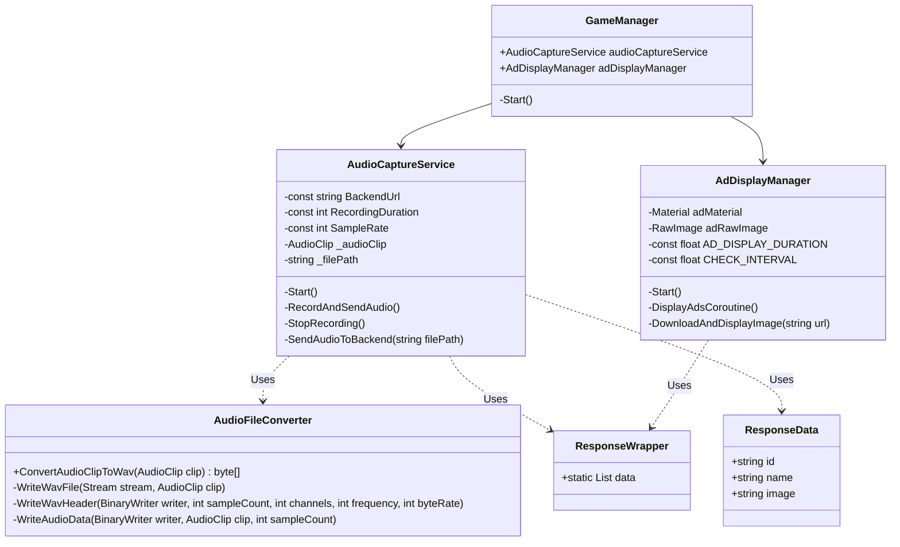

# Unity Audio Recording and Ad Display System

This project implements an audio recording system that sends the recorded audio to a backend server and displays advertisements based on the server's response.

## Architecture

## Setup Instructions

1. Create a new Unity project or open an existing one.

2. Create the following scripts in the `Assets/AdVerse/Scripts` folder:
   - AudioCaptureService.cs
   - AdDisplayManager.cs
   - AudioFileConverter.cs
   - ResponseData.cs
   - ResponseWrapper.cs

3. Copy the provided code into each respective script file.

4. Set up the basic test scene:

   a. Create an empty GameObject and name it `AdVerseManager`.

   b. Add the following components to the `AdVerseManager` GameObject:
   - `AudioCaptureService`
   - `AdDisplayManager`

   c. Create a UI Canvas in your scene if you don't have one already.

   d. Add a `RawImage` component to the Canvas for displaying ads.

   e. In the `AdDisplayManager` component on the `AdVerseManager` gameObject, assign the `RawImage` to the `Ad Raw Image` field.

   f. Attach the material `Ad Material` for displaying ads and assign it to the `Ad Material` field in the `AdDisplayManager` component.

5. The `AudioCaptureService` is preconfigured with the following settings:
   - Backend URL: https://i.p/save-record-web-beta
   - Recording Duration: 5 seconds
   - Sample Rate: 44100 Hz

## How It Works

1. The AudioCaptureService starts recording audio at regular intervals (every 5 seconds).

2. The recorded audio is converted to WAV format using the AudioFileConverter.

3. The WAV file is sent to the backend server using UnityWebRequest.

4. The server responds with ad data, which is stored in the ResponseWrapper.

5. The AdDisplayManager checks for new ad data every 5 seconds and displays ads for 15 seconds each.

## Important Notes

- Ensure that your Unity project has the necessary permissions to access the microphone.
- The backend server should be set up to receive audio files and respond with ad data in the expected format.
- Adjust the recording length and ad display duration in the respective scripts as needed.
- Make sure to handle any necessary error cases and edge scenarios in a production environment.

## Dependencies

- Newtonsoft.Json for JSON serialization/deserialization. Install it via the Unity Package Manager.

## Troubleshooting

- If you encounter issues with audio recording, ensure that your device has a working microphone and that Unity has permission to access it.
- For network-related issues, check your internet connection and verify that the backend URL and API key are correct in the ConfigManager.
- If ads are not displaying, ensure that the RawImage component is properly set up in the scene and assigned to the AdManager.
